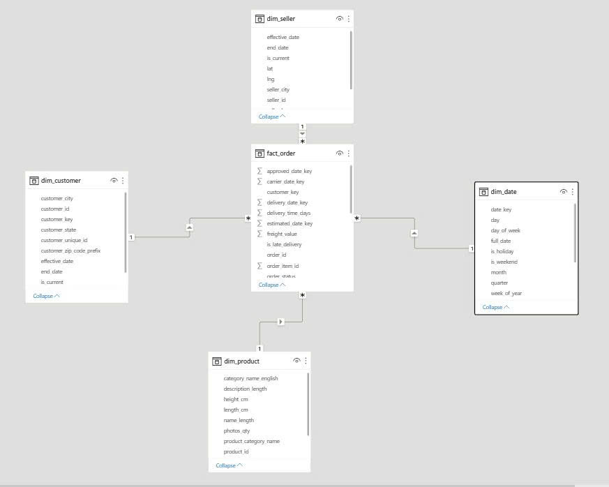
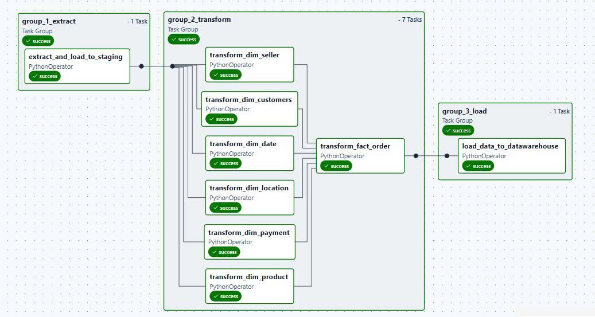
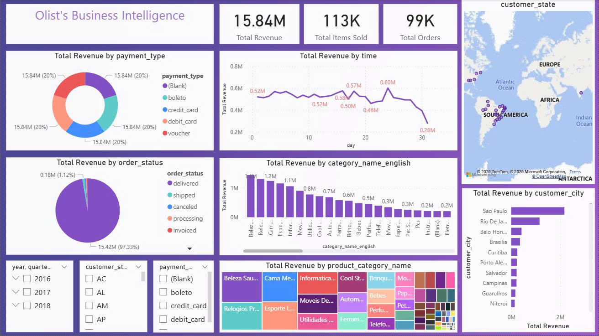
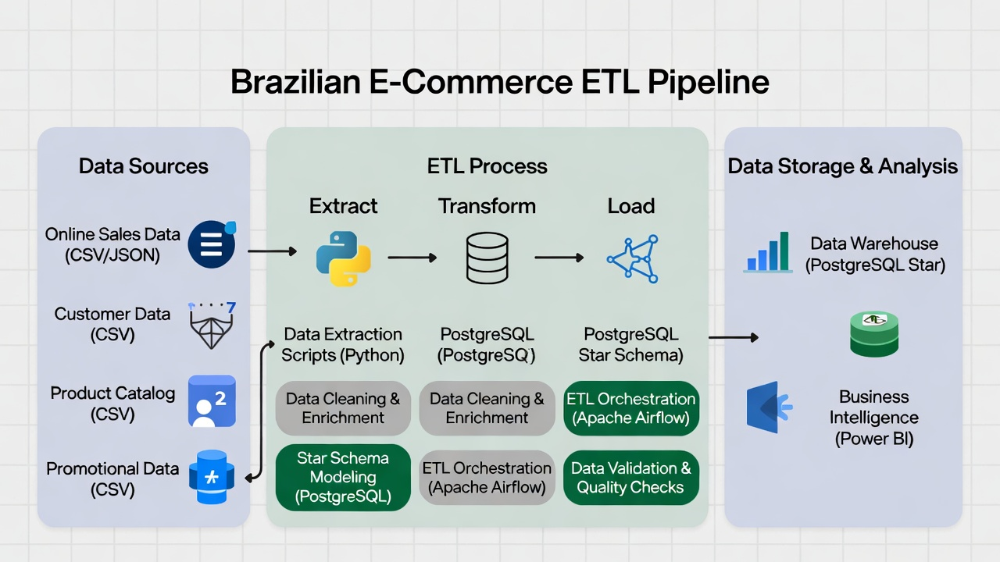

# Brazilian E-Commerce ETL Pipeline

## Description
An ETL project processing the Brazilian E-Commerce public dataset from Kaggle: downloading raw data via Kaggle API, cleaning and joining multiple tables, loading into PostgreSQL, automating the pipeline with Apache Airflow, and building an interactive reporting dashboard.

## Technologies
- Python (Pandas, SQLAlchemy)
- PostgreSQL (Star Schema)
- Apache Airflow (DAG orchestration)
- Docker (local deployment)
- Power BI (Dashboard)

## Architecture

## How to Run
1. Clone the repository:  
   `git clone https://github.com/your-username/your-repo.git`
2. Install dependencies:  
   `pip install -r requirements.txt`
3. Start Docker services:  
   `docker-compose up -d`
4. Access Airflow UI:  
   http://localhost:8080 (default user: `airflow`, password: `airflow`)
5. In the Airflow UI, set up connections to your PostgreSQL database (in the data warehouse and name them `olist_staging` and `olist_warehouse`).
6. Trigger the DAG: Run `etl_dag` manually.

## Dashboard

**Interactive Power BI Dashboard Features**:
- Total Revenue, Total Orders, Items Sold KPIs
- Revenue trends over time
- Sales distribution across Brazilian states (map)
- Top product categories and sellers
- Payment methods and order status analysis

**Power BI File**: Available in `/dashboard/` for full exploration.

## Project Structure

